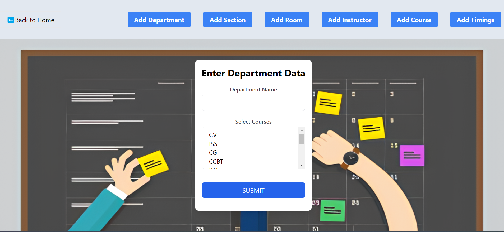
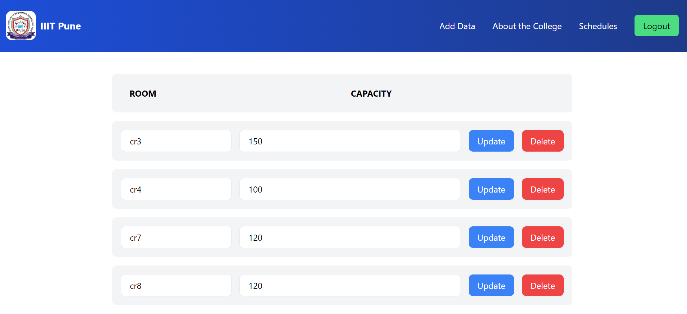
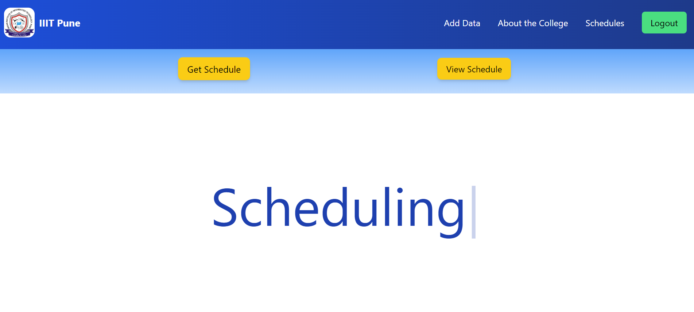

# IIIT-Pune's-Timetabling-System

## Timetable Generator Using Genetic Algorithm
This project is a timetable generator that leverages genetic algorithm to create optimized timetables efficiently. The backend is built with Node.js and MongoDB, while the frontend is built with React.The genetic algorithm is implemented with Python for efficiency purpose and runs on a seperate server.

### Demo Images
  

Follow the instructions below to set up and run the project.

### 1. Configuration:  
Before running the project, you need to set up your configuration:  

#### Python Configurations  
- Create a file named config.py in the root directory of the project.  
- Add the following content to config.py:  
    - MONGO_URL = 'your_mongo_cluster_url_here'  
    - PORT = 'your_port_number_here'

#### Node Configurations
- Create a file named .env in the backend directory of the project.
- Add the following content to .env:
    - MONGO_URL = 'your_mongo_cluster_url_here'
    - PORT = 'your_port_number_here'
    - ACCESS_TOKEN_SECRET = 'random_string'
    - ACCESS_TOKEN_EXPIRY = 1d (for e.g.)
    - REFRESH_TOKEN_SECRET = 'next_random_string'
    - REFRESH_TOKEN_EXPIRY = 10d (for e.g.)

### 2. Running the project
- Node Backend
    - Navigate to the backend directory: `cd backend`
    - Install the required dependencies: `npm install`
    - Run the backend server: `npm start`
- Frontend
    - Navigate to the frontend directory: `cd backend`
    - Install the required dependencies: `npm install`
    - Run the backend server: `npm start`
- Genetic Algorithm
    - Run the Genetic Algorithm: `python geneticAlgo.py`